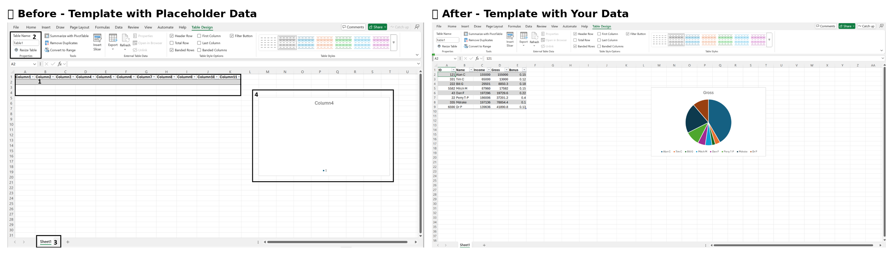

<div align="center">

# Open In Excel

[](https://www.typescriptlang.org/)
[](https://github.com/microsoft/connected-workbooks/blob/master/LICENSE)
[](https://www.npmjs.com/package/@microsoft/connected-workbooks)
[](https://github.com/microsoft/connected-workbooks/actions)

**Send your users straight into Excel for the Web — no sign-in, no install, no friction.**

A JavaScript library that turns any data in your web app into a real Excel workbook and opens it in a new tab in Excel Online — **anonymously**. Your users don't need a Microsoft account. They don't need Excel installed. They don't even need to download a file. They click a button and they're in Excel, ready to slice, sort, pivot, and analyze.

<div align="center">
<a href="https://aka.ms/OpenInExcelREADME" target="_blank">
  
  <br/>
  <strong>📺 Watch the 90-second demo</strong>
</a>
</div>

</div>

---

## 🎯 Why this matters

Every web app that shows data eventually hits the same wall: **users want to take that data into Excel.**

Today, the options are all bad:

| Approach | What goes wrong |
|----------|-----------------|
| 📄 **CSV download** | Loses types, formatting, and structure. Now the user is in their Downloads folder hunting for a file. |
| 🔐 **OneDrive / SharePoint upload** | Requires sign-in, tenant permissions, and a Microsoft account your users may not have. |
| 💻 **"Install Excel desktop"** | A non-starter on Mac, Linux, Chromebooks, mobile, or any locked-down enterprise device. |
| 🛠️ **Build it yourself** | Months of work wrestling with OOXML, ZIP packaging, and Microsoft's upload protocols. |

**Open In Excel removes the wall entirely.** One function call, one new tab, one happy user — already inside Excel for the Web, anonymously.

---

## Open in Excel for the Web — no sign-in required

A minimal end-to-end example:

```typescript
import { workbookManager } from '@microsoft/connected-workbooks';

const myData = {
  config: {
    promoteHeaders: true,      // First row becomes the header row
    adjustColumnNames: true    // De-duplicate / sanitize column names
  },
  data: [
    ["Region",        "Q3 Revenue", "Q4 Revenue", "Growth"],
    ["North America",  2_500_000,    2_750_000,   "10%"],
    ["Europe",         1_800_000,    2_100_000,   "17%"],
    ["Asia Pacific",   1_200_000,    1_400_000,   "17%"],
    ["Latin America",    800_000,      950_000,   "19%"],
  ],
};

const blob = await workbookManager.generateTableWorkbookFromGrid(myData);
await workbookManager.openInExcelWeb(blob, "Q4-Report.xlsx");
```

When the user triggers this flow, a new browser tab opens directly in Excel for the Web with the generated workbook loaded. No sign-in, no download, and no client-side install are required. The experience is consistent across operating systems and form factors — any modern browser is sufficient.

### Why anonymous access matters

Most existing "open in Excel" integrations assume the end user is signed into a Microsoft 365 account. In practice, this introduces several common failure modes:

- Users without a Microsoft 365 account cannot complete the flow.
- Enterprise users frequently encounter SSO and conditional-access friction that requires IT involvement.
- Any authentication step adds drop-off between the user and their data.

`openInExcelWeb()` avoids these issues by uploading the workbook through the same anonymous Office file service used elsewhere on the web and returning a direct link to Excel for the Web. The user reaches the workbook without authenticating.

---

## 🚀 Quick Start

### Install

```bash
npm install @microsoft/connected-workbooks
```

### The 3-line integration

```typescript
import { workbookManager } from '@microsoft/connected-workbooks';

const blob = await workbookManager.generateTableWorkbookFromGrid({ data: myRows });
await workbookManager.openInExcelWeb(blob, "MyData.xlsx");
```

That's the whole thing. Ship it.

---

## Using the library

The library is used in two stages: produce an Excel workbook as a `Blob`, then deliver it to the user.

### 1. Produce a workbook

Call one of the generator functions to obtain a `Blob` containing a valid `.xlsx` file. Inputs may be an HTML `<table>` element, a structured grid, or a Power Query definition. See [Generating the workbook](#-generating-the-workbook) for the available options.

The delivery functions accept any `Blob` representing a valid `.xlsx` file, so the workbook does not have to be produced by this library. Output from third-party libraries such as [ExcelJS](https://github.com/exceljs/exceljs), [SheetJS](https://sheetjs.com/), or any server-side generator can be passed directly to `openInExcelWeb()` or `getExcelForWebWorkbookUrl()`. For example:

```typescript
import ExcelJS from 'exceljs';
import { workbookManager } from '@microsoft/connected-workbooks';

const workbook = new ExcelJS.Workbook();
const sheet = workbook.addWorksheet('Sales');
sheet.addRow(['Region', 'Revenue']);
sheet.addRow(['North America', 2_750_000]);

const buffer = await workbook.xlsx.writeBuffer();
const blob = new Blob([buffer], {
  type: 'application/vnd.openxmlformats-officedocument.spreadsheetml.sheet',
});

await workbookManager.openInExcelWeb(blob, "SalesReport.xlsx");
```

### 2. Deliver the workbook

Two delivery functions are provided:

- **`openInExcelWeb(file, filename?, allowEdit?)`** — uploads the workbook and opens it in Excel for the Web in a new browser tab. `allowEdit` defaults to `true` (edit mode); pass `false` for read-only.
- **`getExcelForWebWorkbookUrl(file, filename?, allowEdit?)`** — performs the same upload but returns the URL as a string, allowing the caller to embed it in a link, email, or message.

Both functions upload through the same anonymous Office file service and do not require the end user to sign in.

```typescript
// Open the workbook in a new tab
await workbookManager.openInExcelWeb(blob, "SalesReport.xlsx");

// Open in read-only mode
await workbookManager.openInExcelWeb(blob, "Q4-Dashboard.xlsx", false);

// Or retrieve the URL for custom delivery
const url = await workbookManager.getExcelForWebWorkbookUrl(blob, "Report.xlsx");
```

> **Note:** the returned URL is unauthenticated. Anyone in possession of the link can open the workbook. Treat it as an unlisted shareable link rather than a secret, and avoid including sensitive content in workbooks distributed this way.

---

## 📦 Generating the workbook

`openInExcelWeb()` accepts any `Blob` containing a valid `.xlsx`. We give you three ways to produce one — pick whichever matches the data you already have.

### From an HTML table on your page

You already render the data as an HTML `<table>`. Convert it in one line.

```typescript
const blob = await workbookManager.generateTableWorkbookFromHtml(
  document.querySelector('table') as HTMLTableElement
);

await workbookManager.openInExcelWeb(blob, "QuickExport.xlsx");
```

### From a raw data grid

You have an array of arrays (or rows from an API). Promote headers, clean up names, ship it to Excel.

```typescript
const salesData = {
  config: {
    promoteHeaders: true,      // First row becomes the header row
    adjustColumnNames: true    // De-duplicate / sanitize column names
  },
  data: [
    ["Product", "Revenue", "InStock", "Category"],
    ["Surface Laptop", 1299.99, true, "Hardware"],
    ["Microsoft 365",  99.99,   true, "Software"],
    ["Azure Credits",  500.00, false, "Cloud"]
  ]
};

const blob = await workbookManager.generateTableWorkbookFromGrid(salesData);
await workbookManager.openInExcelWeb(blob, "SalesReport.xlsx");
```

## Advanced: Power Query connections (live, refreshable data)

For scenarios that require workbooks to retrieve up-to-date data from a remote source rather than embedding a static snapshot, the library can produce a workbook containing a Power Query connection. When the user opens the workbook, Excel executes the embedded query and populates the worksheet with the latest result.

This option is appropriate when:

- The underlying data changes frequently and recipients are expected to refresh.
- The data lives behind a stable HTTP endpoint or any other source supported by Power Query.
- A single workbook needs to be reused over time rather than regenerated for each request.

`generateSingleQueryWorkbook()` accepts a Power Query M expression and a flag indicating whether to refresh automatically when the workbook is opened:

```typescript
const blob = await workbookManager.generateSingleQueryWorkbook({
  queryMashup: `let
    Source = Json.Document(Web.Contents("https://api.contoso.com/sales"))
  in
    Source`,
  refreshOnOpen: true,
});

await workbookManager.openInExcelWeb(blob, "LiveSales.xlsx");
```

Power Query supports a wide range of connectors, transformations, and authentication modes; a full description is outside the scope of this document. Refer to the [official Power Query documentation](https://docs.microsoft.com/en-us/power-query/) for guidance on authoring M expressions. For static exports, the HTML and grid generators described above are typically sufficient and do not require any Power Query knowledge.

### With your own branded template

Bring an Excel file with your charts, formulas, branding, and PivotTables already set up. We'll inject the user's data into the named table and open the result. All your formatting and visualizations come along for the ride.

```typescript
const blob = await workbookManager.generateTableWorkbookFromGrid(
  quarterlyData,
  undefined,
  {
    templateFile: myBrandedTemplate,  // File or Buffer
    TempleteSettings: {
      sheetName: "Dashboard",
      tableName: "QuarterlyData"
    }
  }
);

await workbookManager.openInExcelWeb(blob, "Q4-Executive-Dashboard.xlsx");
```

<div align="center">

</div>

---

## 🎬 Real-world scenarios

### "Open in Excel" button on a public-facing report

Your marketing site shows a public sales leaderboard. Visitors aren't signed in and never will be. They click "Open in Excel" → new tab → they're in Excel Online, sorting and filtering. **No login wall.**

### Embedding live data in customer emails

Your CRM sends quarterly summaries to customers. Generate the workbook, get the URL with `getExcelForWebWorkbookUrl()`, drop it in the email. The customer clicks once and is in Excel — no app, no install, no account.

### Internal tools for mixed-device fleets

Your ops team is on Macs, Chromebooks, and locked-down VDIs. Excel desktop isn't an option. `openInExcelWeb()` works identically on every one of them, because it's just a URL in a browser.

### View-only handoff to non-technical stakeholders

Generate a finished report, open it in **view mode** (`allowEdit: false`) so the stakeholder can read but not accidentally edit. They get the full Excel rendering — formulas, charts, conditional formatting — without any risk.

---

## 🏢 Already powering

Open In Excel ships in production across Microsoft's enterprise platforms:

<div align="center">

|||||
|:---:|:---:|:---:|:---:|
|**Azure Data Explorer**|**Log Analytics**|**Datamart**|**Viva Sales**|

</div>

---

## 📚 Full API Reference

### Open / share

#### 🌐 `openInExcelWeb()`
```typescript
async function openInExcelWeb(
  file: Blob,
  filename?: string,
  allowEdit?: boolean
): Promise<void>
```
Uploads the workbook anonymously and opens it in Excel for the Web in a new tab.

#### 🔗 `getExcelForWebWorkbookUrl()`
```typescript
async function getExcelForWebWorkbookUrl(
  file: Blob,
  filename?: string,
  allowEdit?: boolean
): Promise<string>
```
Same upload, returns the URL. Use when you want to embed, share, or route the link yourself.

#### 💾 `downloadWorkbook()`
```typescript
function downloadWorkbook(file: Blob, filename: string): void
```
Old-school browser download fallback, in case you still need it.

### Generate

#### 📋 `generateTableWorkbookFromHtml()`
```typescript
async function generateTableWorkbookFromHtml(
  htmlTable: HTMLTableElement,
  fileConfigs?: FileConfigs
): Promise<Blob>
```

#### 📊 `generateTableWorkbookFromGrid()`
```typescript
async function generateTableWorkbookFromGrid(
  grid: Grid,
  fileConfigs?: FileConfigs
): Promise<Blob>
```

#### 🔄 `generateSingleQueryWorkbook()`
```typescript
async function generateSingleQueryWorkbook(
  query: QueryInfo,
  grid?: Grid,
  fileConfigs?: FileConfigs
): Promise<Blob>
```

---

## 🔧 Type Definitions

```typescript
interface QueryInfo {
  queryMashup: string;        // Power Query M code
  refreshOnOpen: boolean;     // Auto-refresh when opened
  queryName?: string;         // Default: "Query1"
}

interface Grid {
  data: (string | number | boolean)[][];
  config?: {
    promoteHeaders?: boolean;
    adjustColumnNames?: boolean;
  };
}

interface FileConfigs {
  templateFile?: File | Buffer;
  docProps?: DocProps;
  hostName?: string;
  TempleteSettings?: {
    tableName?: string;
    sheetName?: string;
  };
}

interface DocProps {
  title?: string;
  subject?: string;
  keywords?: string;
  createdBy?: string;
  description?: string;
  lastModifiedBy?: string;
  category?: string;
  revision?: string;
}
```

---

## ❓ FAQ

**Does the user need a Microsoft account?**
No. That's the whole point. The workbook is uploaded to Microsoft's anonymous Office file service and opened in a new tab. No account, no sign-in, no tenant.

**Does the user need Excel installed?**
No. It opens in Excel for the Web, in the browser they already have.

**Can the workbook be edited after it opens?**
Yes — by default. Pass `allowEdit: false` if you want view-only.

**Are the uploaded files private?**
The URL is unguessable but not authenticated — anyone with the link can open the workbook. Treat it like an unlisted share link. Don't put secrets in it.

**Does this work on mobile?**
Yes. Excel for the Web works in mobile browsers, so anything that opens a new tab will work.

**Can I host the file myself instead?**
Yes — generate the `Blob` with our helpers, host it wherever you want, and skip `openInExcelWeb()` entirely. The generation APIs are independent of the open-in-Excel flow.

---

## Contributing

This project welcomes contributions and suggestions. Most contributions require you to agree to a Contributor License Agreement (CLA) declaring that you have the right to, and actually do, grant us the rights to use your contribution. For details, visit https://cla.opensource.microsoft.com.

When you submit a pull request, a CLA bot will automatically determine whether you need to provide a CLA and decorate the PR appropriately. Simply follow the bot's instructions. You only need to do this once across all repos using our CLA.

This project has adopted the [Microsoft Open Source Code of Conduct](https://opensource.microsoft.com/codeofconduct/). For more information see the [Code of Conduct FAQ](https://opensource.microsoft.com/codeofconduct/faq/) or contact [opencode@microsoft.com](mailto:opencode@microsoft.com).

### Development Setup
```bash
git clone https://github.com/microsoft/connected-workbooks.git
cd connected-workbooks
npm install
npm run build
npm test
```

---

## 📄 License

MIT — see [LICENSE](LICENSE).

## 🔗 Related Resources

- [📖 Power Query Documentation](https://powerquery.microsoft.com/en-us/)
- [🏢 Excel for Developers](https://docs.microsoft.com/en-us/office/dev/excel/)
- [🔧 Microsoft Graph Excel APIs](https://docs.microsoft.com/en-us/graph/api/resources/excel)

---

## Trademarks

This project may contain trademarks or logos for projects, products, or services. Authorized use of Microsoft trademarks or logos is subject to and must follow [Microsoft's Trademark & Brand Guidelines](https://www.microsoft.com/en-us/legal/intellectualproperty/trademarks/usage/general). Use of Microsoft trademarks or logos in modified versions of this project must not cause confusion or imply Microsoft sponsorship. Any use of third-party trademarks or logos are subject to those third-party's policies.

---

## Keywords

Open in Excel, Excel for the Web, Excel Online, anonymous Excel, no sign-in Excel, Power Query, Excel, Office, Workbook, Refresh, Table, xlsx, export, data export, HTML table, web to Excel, JavaScript Excel, TypeScript Excel, Excel template, PivotTable, connected data, live data, data refresh, browser Excel, spreadsheet, data visualization, Microsoft Office, Office 365, Excel API, workbook generation, table export, grid export, Excel automation, business intelligence
